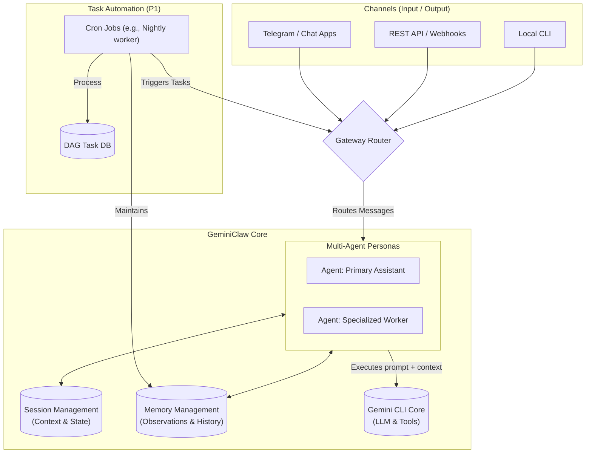

# GeminiClaw Architecture

This document describes the high-level architecture of GeminiClaw, inheriting the resilient and modular traits from the Nanobot and OpenClaw projects, adapted for the Gemini CLI core.

## Key Components Diagram

## Tech Stack Choices

The overall architecture requires finalizing toolsets and frameworks for several core components. Below is the list of pending decisions:

### 1. Gateway & Routing
*Responsible for receiving external events and routing them to the correct agent.*
- **API Framework:** `express` (To start with)
- **Event Bus:** In-memory event emitter (To start with)

### 2. Session & Memory Storage
*Responsible for storing chat history, agent state, and long-term observations.*
- **Session DB:** Simple JSON files.
- **Memory Retrieval:** Progressive disclosure using markdown files. Maintained automatically with a cron job to keep it clean via progressive summarization. (No vector DB needed yet)

### 3. Task Automation & Cron
*Responsible for background jobs, memory compaction, and scheduled triggers.*
- **Task Queue & Scheduler:** `BullMQ` (Serves as both the queuing system and the cron-like job scheduler)

### 4. Core Engine Integration
*Responsible for LLM generation and tool use.*
- **SDK Wrapping:** We are using Google's `@google/gemini-cli-sdk`.
- **Model Choice:** Flexible; starting with **Gemini 2.5 Flash** (Leveraging existing Gemini subscription for tokens).

### 5. Channels
*Responsible for ingesting external prompts and delivering agent responses.*
- **Telegram Bot API library:** `grammY` (Consistent with the OpenClaw architecture)

*(Each of these components will be expanded upon during the detailed design phase)*
