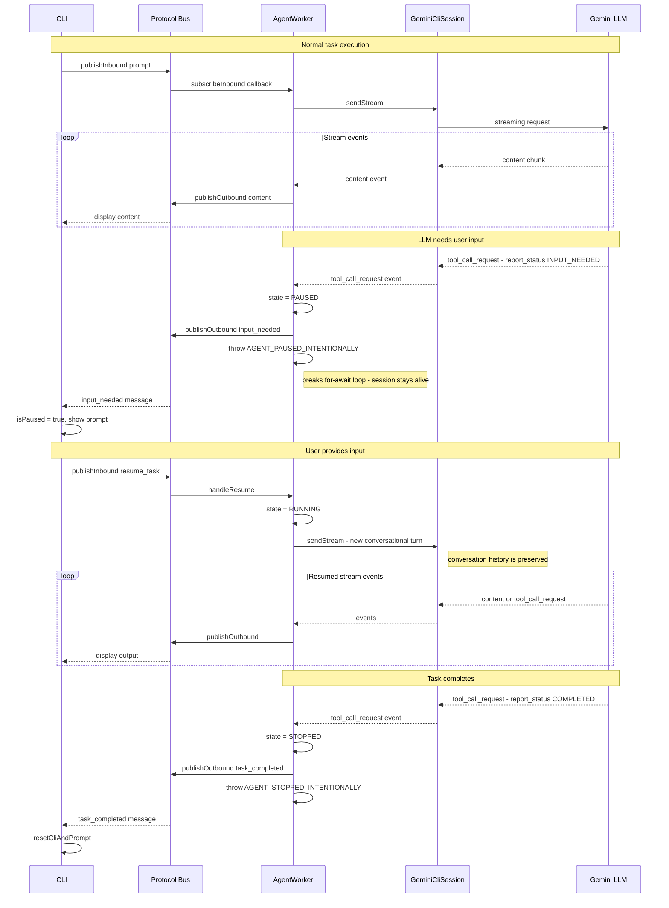

# Source Component: `agent`

This directory houses the LLM Execution Engine. It is responsible for instantiating the `@google/gemini-cli-sdk`, managing the LLM session capabilities, and injecting custom behavior via Tools.

## Core Responsibilities
- **`worker.ts`**: The primary `AgentWorker` class. It initializes the `GeminiCliAgent` and listens for `InboundMessage` events from the Protocol Bus. As the LLM stream resolves, it translates those stream chunks back into `OutboundMessage` events.
- **`registry.ts`**: Parses the `agents.json` configuration file, allowing for dynamically loaded system prompts and tool constraints based on an `Agent ID`.
- **`statusTool.ts`**: A custom injected explicit tool designed for agent state tracking (e.g., `COMPLETED` or `BLOCKED`).

## Architectural Constraints
- The Agent worker MUST NOT be aware of how the interface is delivered. It should never use `console.log` directly. All LLM text and events must be piped down using `publishOutbound()`.
- **Zod Dependency:** When modifying tools, do not alter the `zod` package version, as doing so will break the `instanceof ZodType` check inside the underlying Google CLI SDK during startup.

---

## Session Pausing & Resumption

The Gemini CLI SDK's streaming session (`GeminiCliSession`) does not natively support pausing mid-stream. This section documents the mechanism `worker.ts` and `statusTool.ts` use together to achieve reliable pause and resume without destroying the conversation context.

### The Core Problem

When the LLM needs human input (e.g., a filename, a confirmation), we cannot simply block the `for await` loop — Node.js is single-threaded and blocking the event loop would freeze the process. We also cannot `return` from `handlePrompt`, because that would close the stream and discard in-flight SDK state. The solution is to **intentionally throw a sentinel exception** to cleanly break out of the stream loop while keeping the `GeminiCliSession` object alive for the next turn.

### WorkerState Machine

```
INITIALIZED ──start()──► RUNNING
                              │
              report_status(INPUT_NEEDED)
                              │
                           PAUSED
                              │
              resume_task message arrives
                              │
                           RUNNING
                              │
        report_status(COMPLETED | FAILED)
                              │
                           STOPPED
```

### Sequence Diagram

The following covers both the **happy path** (task completes) and the **pause/resume path** (task needs user input).



### Key Design Decisions

| Decision | Rationale |
|---|---|
| **Throw sentinel exception** instead of `return` | `return` from `handlePrompt` also exits normally, but we need the `catch` block to distinguish intentional pauses from real errors. The sentinel string on `err.message` is the discriminator. |
| **`AGENT_PAUSED_INTENTIONALLY` vs `AGENT_STOPPED_INTENTIONALLY`** | Two separate sentinels allow the catch block to know whether to stay `PAUSED` or transition to `STOPPED` (though currently both are handled the same way). |
| **Resume via a new `sendStream` call** | The SDK does not expose a "resume" API. Instead, we treat the resume input as a new conversational turn. The `[User Resumed Task]:` prefix in `RESUME_PREFIX` signals to the LLM the context of the new message. |
| **`statusTool` intercepted in worker, not forwarded to SDK** | `report_status` tool calls are consumed entirely by `worker.ts` before they are re-emitted. The SDK never sees the tool response; the sentinel throw is the "response". This avoids the SDK waiting on a tool result that will never arrive. |

### Debugging Tips

- If the agent silently drops a user message after resuming, check `WorkerState`. A `prompt` arriving while `state !== 'RUNNING'` is silently ignored (see TODO in `handlePrompt`).
- If the process exits unexpectedly on stream teardown, check the `uncaughtException` handler in `index.ts` — it suppresses `AbortError`s globally as a workaround for the SDK not catching them internally.
- The `GeminiCliSession` object is intentionally kept alive across pause/resume cycles. A new session is **not** created — this preserves conversation history.
